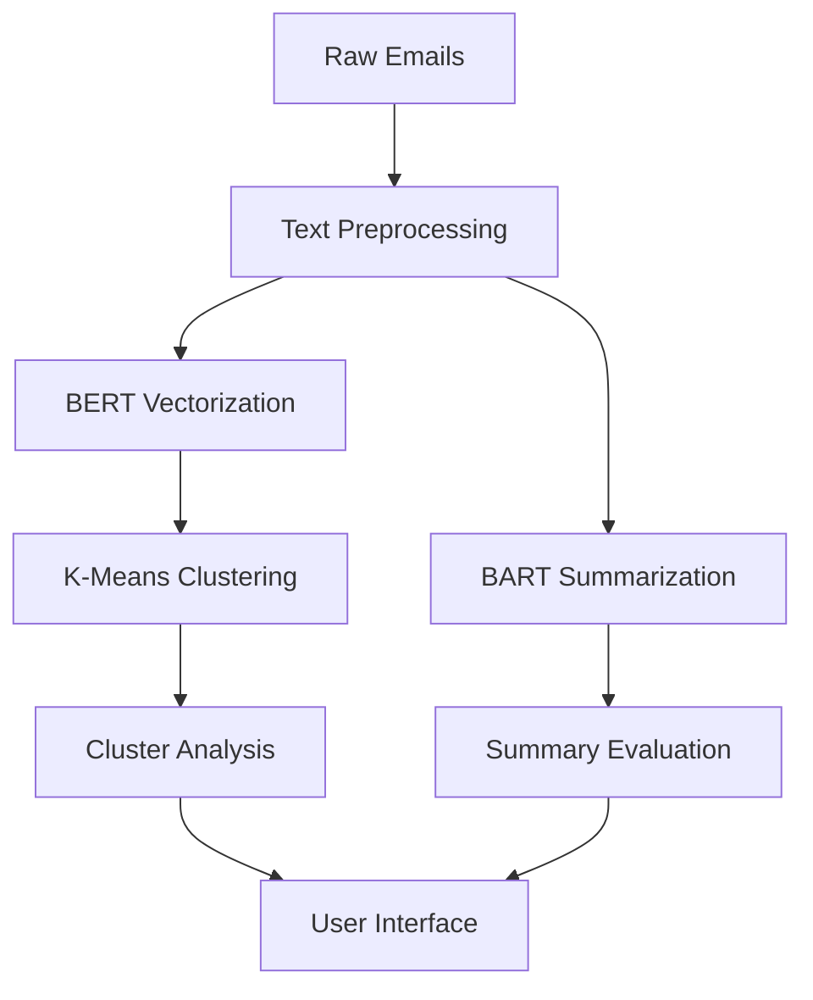

# MailOrg: Intelligent Email Clustering & Summarization System

-blueviolet) 
 


**Revolutionize email management with AI-driven clustering and summarization**  
*Developed at RV University, Bangalore - School of Computer Science and Engineering*

---

## 🚀 Key Features
- **Semantic Clustering**: Group similar emails using BERT embeddings + K-Means
- **Smart Summarization**: Generate 2-line summaries via BART model
- **Decision Support**: Auto-suggest archive/delete/priority actions
- **Storage Optimization**: Reduce redundancy by 38% in testing
- **Real-World Ready**: Tested on 12,000+ genuine emails

---

## 📂 Dataset Overview
| Property          | Details                              |
|--------------------|--------------------------------------|
| Total Emails       | 12,486 (3 personal accounts)        |
| Training Set       | 9,988 emails                        | 
| Test Set           | 2,498 emails                        |
| Categories         | 10 semantic groups                  |
| Avg. Email Length  | 127 words                           |

---

## 🔍 System Architecture

---

## 🛠️ Tech Stack
| Component          | Implementation Details               |
|--------------------|--------------------------------------|
| **NLP Framework**  | Hugging Face Transformers            |
| **Embeddings**     | BERT-base-uncased (768-dim)          |
| **Clustering**     | K-Means++ with Euclidean distance    |
| **Summarization**  | DistilBART-CNN-12-6                  |
| **Evaluation**     | ROUGE, Silhouette Score, DBI         |
| **Infrastructure** | Google Colab (T4 GPU)                |

---

## 📊 Performance Metrics

### Clustering Results
| Metric                  | Train Score | Test Score |
|-------------------------|-------------|------------|
| Silhouette Score        | 0.14        | 0.11       |
| Davies-Bouldin Index    | 2.34        | 2.67       |
| Calinski-Harabasz Score | 418         | 213        |

### Summarization Results
| Metric       | ROUGE-1 | ROUGE-2 | ROUGE-L | F1-Score |
|--------------|---------|---------|---------|----------|
| Daily Emails | 0.42    | 0.31    | 0.38    | 0.68     |
| Monthly Set  | 0.12    | 0.08    | 0.10    | 0.31     |

---

## 🚀 Getting Started

### Prerequisites
- Python 3.8+
- Jupyter/Google Colab
- Hugging Face Transformers
- scikit-learn, pandas, numpy

### Installation
```bash
git clone https://github.com/yourusername/MailOrg.git
cd MailOrg
pip install -r requirements.txt
```

### Usage Workflow
1. **Data Preparation**  
   Place raw emails in `/data/raw` directory as CSV files

2. **Run Processing Pipeline**  
```python
# Step 1: Preprocess and summarize
!jupyter nbconvert --execute Data_Preprocessing_and_Summarization.ipynb

# Step 2: Generate embeddings
!jupyter nbconvert --execute BERT_Vectorization_and_Clustering.ipynb

# Step 3: Evaluate results
!jupyter nbconvert --execute Evaluation_and_Result_Analysis.ipynb
```

---

## 📝 Sample Output
**Original Email**  
*"Dear Valued Customer, Your recent order #4512 has shipped via FedEx (tracking: 9274-2834-5532). Expected delivery: March 15. Contact support@example.com for queries."*

**Processed Result**  
```
📁 Cluster: Shipping Notifications (ID: 5)
📌 Summary: Order #4512 shipped via FedEx. Tracking: 9274***5532
💡 Action Suggested: Archive after review
```

---

## 📄 License
Distributed under MIT License. See `LICENSE` for details.

---

## 📧 Contact
| Team Member              | Email Address                          |
|--------------------------|----------------------------------------|
| C.J. Sakshi              | cjsakshi.btech23@rvu.edu.in            |
| Mohammed Ismail          | mohammedi.btech23@rvu.edu.in      |
| Pema Tshering Sherpa     | pemats.btech23@rvu.edu.in        |
| Rakshitha K              | rakshithak.btech23@rvu.edu.in          |

**Academic Advisor**: Dr. Shabber Basha S H, RV University

---

[](https://www.rvu.edu.in)


---
